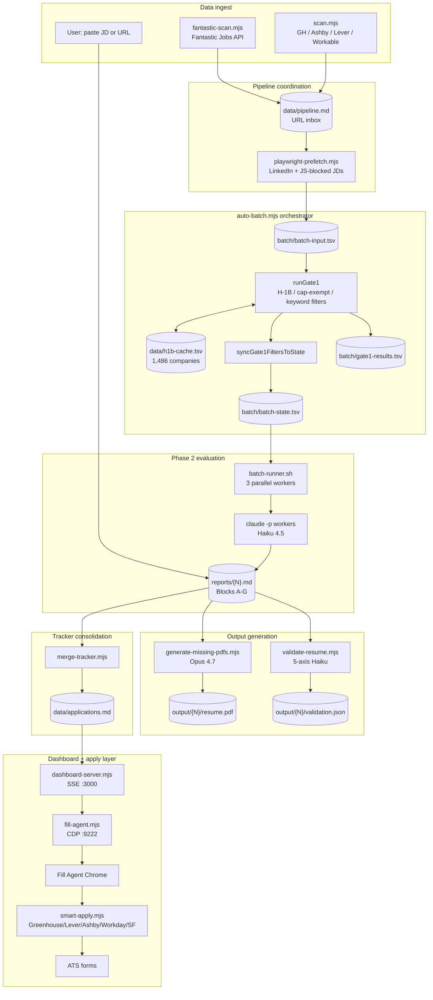

# Architecture

Component-oriented overview of the system. For end-to-end journeys (job URL → evaluation → application), read [PIPELINE.md](PIPELINE.md). For troubleshooting, read [DEBUGGING.md](DEBUGGING.md).

## System diagram



---

## Components

### Ingest layer

| Component | Purpose | Runs |
|---|---|---|
| `fantastic-scan.mjs` | Pull last-24h postings from Fantastic Jobs API (~500-1000 jobs/day). Visa-gated title filter. Requires `FANTASTIC_JOBS_API_KEY`. | On demand or via 6pm launchd job |
| `scan.mjs` | Zero-token portal scanner. Hits Greenhouse / Ashby / Lever / Workable / SmartRecruiters / Recruitee / Polymer / Personio APIs directly. Configuration in `portals.yml`. | On demand or via 6pm launchd job |
| Manual paste (Claude Code CLI) | User pastes a URL or JD text. Enters as a single evaluation. | Any time |

### Pipeline coordination

| Component | Purpose | State file |
|---|---|---|
| `data/pipeline.md` | Inbox of pending URLs. Newly scanned URLs are appended. Once evaluated, marked with `[x]`. | Markdown |
| `playwright-prefetch.mjs` | Uses headless Chromium to fetch JD text for LinkedIn URLs and JS-blocked domains (Workday, Taleo, etc.) that WebFetch can't handle. Saves to `/tmp/batch-jd-{id}.txt`. | Ephemeral cache |

### Orchestration

**`auto-batch.mjs`** — the main orchestrator, called by both the 6pm scan chain and the 4:35am batch retry. Its main function calls, in order:

```
syncPipeline()               → merge pipeline.md into batch-input.tsv
resetRateLimitFailures()     → flip 'failed' back to 'pending' for retries
runGate1()                   → filter cheap: H1B + keyword + cap-exempt + LCA
syncGate1FiltersToState()    → propagate FILTER verdicts to batch-state.tsv
playwrightPrefetch()         → fetch JD text for URLs Gate1 passed
syncResolvedUrlsToBatchState() → rewrite LinkedIn → resolved ATS URLs
runBatch()                   → spawn batch-runner.sh
scheduleRetryFromRateLimitHint() → arm retry launchd if rate-limited
mergeTracker()               → merge TSVs into applications.md
dedupTracker()               → collapse duplicates
resolveLinkedInReports()     → backfill resolved URLs into report headers
verifyPipeline()             → data hygiene check
markPipelineDone()           → mark pipeline.md entries as [x]
```

### Gate1 — cost-saving filter

Gate1 is the first pass. It rejects obvious non-fits BEFORE spawning Claude workers so we don't spend tokens on jobs that will clearly fail. Detailed decision flow in [PIPELINE.md → Journey 3](PIPELINE.md#journey-3--gate1-h1b-check-for-a-new-company).

Filter categories:
- **Foreign / anonymous** — non-US employers, generic recruiter aliases
- **Cap-exempt by name pattern** — universities, hospitals, government
- **Hard-reject keyword in JD** — visa-gated per `userNeedsSponsorship()`
- **Cap-exempt by JD content** — 501c3, non-profit, etc.
- **LCA threshold** — h1bdata.info-verified count. **Only enforced for sponsorship-requiring users** (H-1B, F-1 OPT, L-1). US Citizens, Green Card holders, Permanent Residents bypass this check.

### Phase 2 — LLM evaluation

**`batch/batch-runner.sh`** spawns N=3 parallel `claude -p` workers. Each worker:
1. Reads `batch/batch-prompt.md` (the Blocks A-G evaluation template)
2. Loads context: `modes/_shared.md`, `modes/oferta.md`, `cv.md`, `modes/_profile.md`
3. Fetches JD (from `/tmp/batch-jd-{id}.txt` if pre-fetched, else WebFetch)
4. Writes `reports/{N}-{slug}-{date}.md`
5. Writes `batch/tracker-additions/{N}-{slug}.tsv`
6. Reports back to `batch-state.tsv`

Workers respect the following batch-state statuses (skip these):
- `completed` — already evaluated successfully
- `failed` (with retries ≥ MAX_RETRIES) — abandoned
- `gate1_filtered` — Gate1 rejected, don't waste tokens

### CV generation

**`generate-missing-pdfs.mjs`** — post-batch pass. Finds every report where the tracker claims a PDF but the file doesn't exist, then spawns a focused `claude -p` worker using **Opus 4.7** (chosen for constraint-following + proof-point selection on tailored CVs). The worker:

1. Reads `cv.md` (source of truth), the report's Block E (customization plan), and `modes/_profile.md` (CV Format Standards)
2. Produces `output/{N}/cv-content.json` — deterministic content, no HTML
3. `build-tailored-cv.mjs` renders the JSON into `output/{N}/cv-tailored.html` via `templates/cv-template.html`
4. `generate-pdf.mjs` uses Playwright Chrome to convert HTML → PDF

Design choice: **JSON-then-template**, not "let Claude write HTML." The structure + CSS come from the template byte-for-byte. Claude only decides what content goes where. This eliminates CV format drift across evaluations.

### Semantic CV validation

**`validate-resume.mjs`** — Claude Haiku 4.5-powered 5-axis validator that scores each tailored CV against `cv.md`:

- `jd_alignment` — how well the CV highlights JD-relevant experience
- `source_fidelity` — did we invent anything not in cv.md? (strict zero-fabrication check)
- `best_extraction` — did we surface the strongest proof points?
- `natural_voice` — reads like a human wrote it, not a rewrite artifact
- `technical_coherence` — technical vocabulary is consistent with what a senior in this role would use

Output written to `output/{N}/validation.json`. Dashboard renders as ✓ / ⚠ ticks with the score.

Trigger paths:
- **Auto**: on report generation in `generate-missing-pdfs.mjs:fireValidationIfEligible` (only for jobs in Apply Queue eligible per `queue-eligibility.mjs`)
- **Bulk**: `backfill-validation.mjs` for retroactive validation on all queue jobs
- **On-demand**: dashboard triggers validation when opened

### Tracker consolidation

**`merge-tracker.mjs`** — reads every `batch/tracker-additions/*.tsv` and merges into `data/applications.md`. Idempotent: if company+role already exists, updates the existing row instead of duplicating.

Report links normalized: TSVs carry a root-relative `[N](reports/...)` link. Merge rewrites to `../reports/...` when the tracker is at `data/applications.md`. Prevents dead links.

### Dashboard + apply layer

**`dashboard-server.mjs`** — SSE-based Node HTTP server on port 3000.

- Endpoint `/` — serves the dashboard UI (HTML + inline JS)
- Endpoint `/events` — SSE stream. Server pushes new validation results, PDF backfills, and tracker updates as they happen. No client-side polling needed.
- Endpoint `/api/*` — REST endpoints for status changes, revert, PDF triggering, etc.

Lifecycle: `dashboard-server.mjs` self-terminates ~3 seconds after the client disconnects from `/events` (SSE close). This is what makes `CareerOps.app` close cleanly when you close the dashboard tab.

**`fill-agent.mjs`** — Playwright + CDP client. Attaches to a Chrome instance launched by `launch-chrome.sh` with `--remote-debugging-port=9222`. Watches every tab. When URL matches a known ATS + job in the tracker, it:

1. Loads the report to get the job context (company, role, tier)
2. Detects ATS via `smart-apply.mjs:detectATS`
3. Injects a floating banner into the page with Pause / Resume / Fill Now controls
4. Runs the appropriate `fill{ATS}` function from `smart-apply.mjs`
5. Attaches the tailored PDF to the file input
6. Verifies the attach via browser-side readback (compares `files[0]` to the intended PDF path)
7. Waits for you to review and submit

**`smart-apply.mjs`** — ATS-specific fill handlers:
- `fillGreenhouse` — Greenhouse v1 (structured fields) and v2 (custom question blocks)
- `fillLever` — Lever posting pages (2020+ version)
- `fillAshby` — Ashby (React-heavy, requires specific timing)
- `fillWorkday` — Workday tenants (SPA transitions handled via URL polling)
- `fillGeneric` — fallback for unknown SPA-based ATSes detected via query params (`?gh_jid=` etc.)

Wrapped ATS detection: some employers use LinkedIn Job IDs that redirect to their own domain wrapping Greenhouse. Query params tell the fill agent to route to Greenhouse regardless of the URL host. See `smart-apply.mjs:detectATS`.

### Personalization layer

Three files hold user-specific configuration. **None** are auto-updated by `update-system.mjs`:

- `cv.md` — source-of-truth CV. Referenced during evaluation, CV generation, and fill agent.
- `config/profile.yml` — identity + comp targets + visa status. YAML.
- `modes/_profile.md` — scoring weights, archetype framing, negotiation scripts, CV Format Standards, visa/sponsorship policy details. Markdown.

The system reads these at runtime — no compilation or restart needed after edits.

---

## File naming conventions

- Reports: `reports/{NNN}-{company-slug}-{YYYY-MM-DD}.md` (3-digit zero-padded numeric)
- PDFs: `output/{NNN}/resume.pdf` — one directory per report
- Validation: `output/{NNN}/validation.json` — sidecar in the same directory
- Tracker TSVs: `batch/tracker-additions/{NNN}-{slug}.tsv`
- Batch state: `batch/batch-state.tsv`, `batch/gate1-results.tsv`, `batch/batch-input.tsv`

## Pipeline integrity scripts

| Script | Purpose |
|---|---|
| `merge-tracker.mjs` | Consolidate batch TSVs into `applications.md` |
| `verify-pipeline.mjs` | Health check: canonical statuses, duplicates, dead report links |
| `dedup-tracker.mjs` | Remove duplicates by (company + role) |
| `normalize-statuses.mjs` | Map status aliases to canonical values |
| `cv-sync-check.mjs` | Validate that `cv.md`, profile, and portals are consistent |
| `doctor.mjs` | Cold-start check — reports which user-layer files are missing |
| `test-all.mjs` | 190+ project-wide correctness tests |

## Testing

Every push runs `test-all.mjs` via GitHub Actions. Two known failures (pre-existing) are acceptable:

- `verify-pipeline.mjs` reports non-canonical statuses in `applications.md` — data hygiene, not code
- Dashboard Go build — the legacy Go TUI dashboard requires `go` installed. The current SSE dashboard is Node-only and doesn't need it.

New code should not add regressions beyond these two.

## Enhancements in this fork

Compared to `santifer/career-ops`, this fork adds:

- **SSE-based dashboard** (`dashboard-server.mjs`) — real-time updates, no polling. Replaces the upstream's Go TUI.
- **5-axis semantic CV validator** (`validate-resume.mjs`) — Haiku 4.5-scored validation with strict source-fidelity enforcement.
- **Fill agent reliability layer** (`fill-agent.mjs` + `smart-apply.mjs`) — Playwright + CDP with Pause/Resume/Fill Now controls, wrapped-ATS detection, URL-poll backstop for SPA transitions, browser-readback attach verification.
- **Production lifecycle management** (`start.sh` + `launch-chrome.sh`) — SSE-disconnect fast shutdown, signal-trap Chrome cleanup, multi-tab detection.
- **Visa-gating framework** across `auto-batch.mjs`, `fantastic-scan.mjs`, `queue-eligibility.mjs` — H-1B, US Citizen, Green Card, F-1 OPT, L-1 all correctly gated per `visa_status` in `config/profile.yml`.
- **Gate1 → Phase 2 respect** — `syncGate1FiltersToState()` propagates Gate1 verdicts to `batch-state.tsv` as `gate1_filtered` status. Downstream steps skip these, saving Claude tokens.
- **launchd automation templates** — `templates/launchd-*.plist.example` for adopters who want 24/7 automation.
- **h1b-cache with auto-learning** — `data/h1b-cache.tsv` populated automatically from h1bdata.info with suffix-expansion fallback for name variations.
- **Fantastic Jobs API integration** — `fantastic-scan.mjs` for aggregated ATS-integrated postings.

Full commit history: `git log --oneline main` on this repo.
