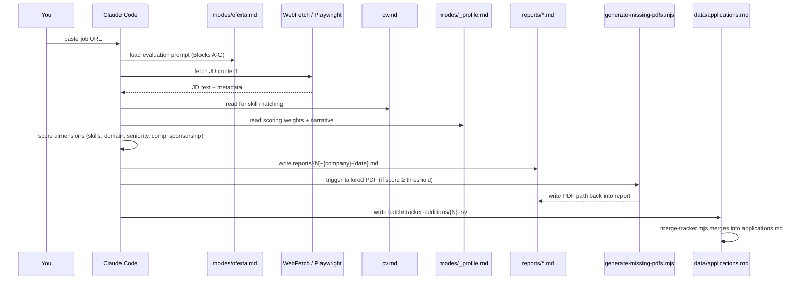
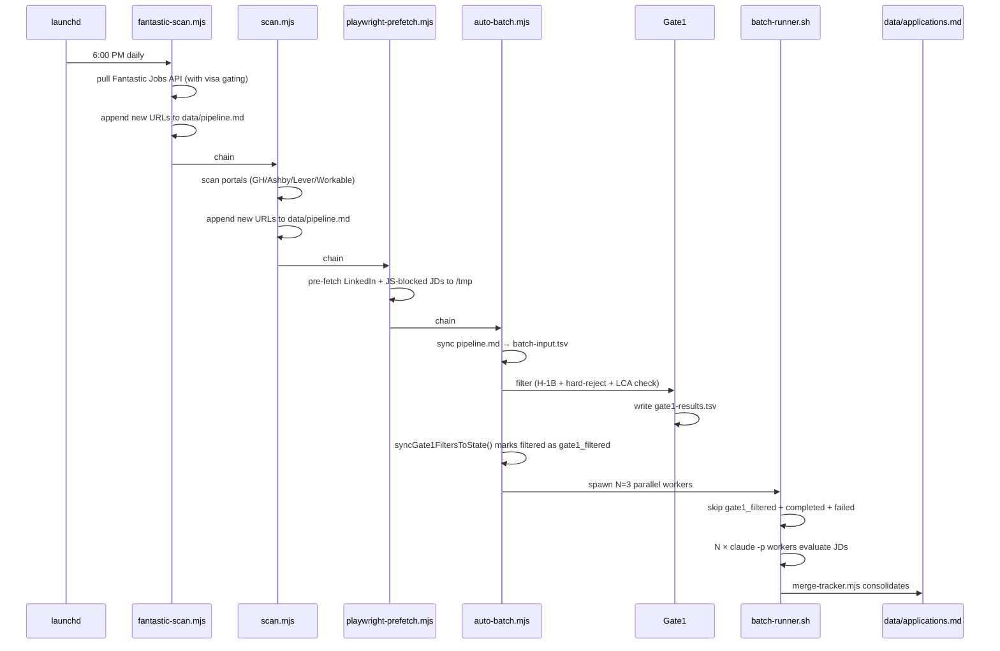
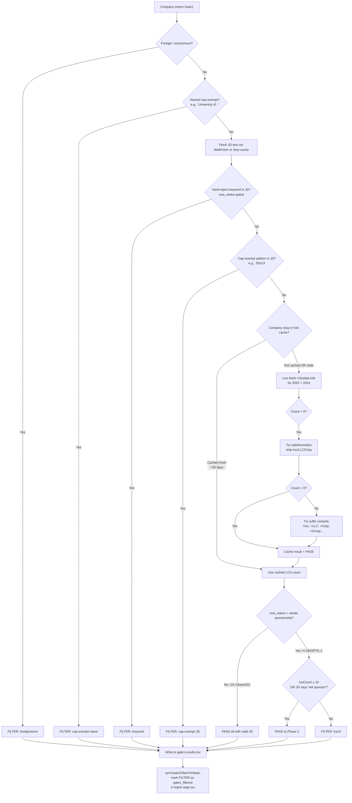
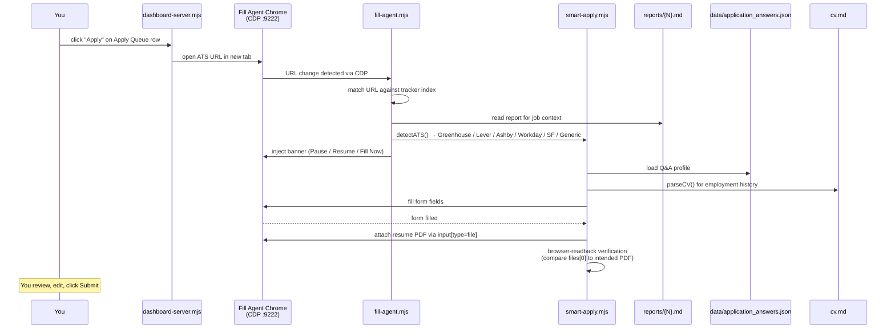

# Pipeline Flow

End-to-end walkthrough of what happens between a job URL entering the system and an application being submitted. Covers the four primary journeys plus the state machines that hold everything together.

If you want a quick component overview instead, read [ARCHITECTURE.md](ARCHITECTURE.md). If you're debugging why something didn't work, read [DEBUGGING.md](DEBUGGING.md). This doc is the "how it actually flows end-to-end" reference.

---

## The four primary journeys

1. [Single evaluation](#journey-1--single-evaluation) — you paste a JD URL and get an evaluation report + tailored CV
2. [Scheduled scan chain](#journey-2--scheduled-scan-chain) — the 6pm launchd job that pulls new jobs, filters, evaluates, and updates the tracker overnight
3. [Gate1 h1b check](#journey-3--gate1-h1b-check-for-a-new-company) — what happens when a company the system has never seen before enters the pipeline
4. [Fill agent application](#journey-4--fill-agent-application) — you click Apply on the dashboard and the fill agent takes over

---

## Journey 1 — Single evaluation

You paste a URL into Claude Code and say "evaluate this." Here's what happens.



### Step-by-step

**1. URL ingestion.** Claude Code reads the URL you pasted. If it's a JD text paste (not a URL), skip to step 3.

**2. JD extraction.** `WebFetch` for standard sites; `Playwright browser_navigate` for JS-blocked domains (Workday, Taleo, iCIMS, Dayforce, Oracle HCM, ADP, etc.). The list of JS-blocked domains lives in `auto-batch.mjs:JS_BLOCKED_DOMAINS`.

**3. Context loading.** Claude reads `modes/_shared.md` + `modes/oferta.md` (the evaluation prompt), `cv.md` (your source-of-truth CV), and `modes/_profile.md` (your scoring weights + archetype framing + visa policy + comp targets). The last one is critical — it's where personalization lives.

**4. Scoring across 5 dimensions.** Per the formula in `modes/oferta-slim.md`:
```
Final = (skills × 0.30) + (domain × 0.20) + (seniority × 0.15) + (comp × 0.10) + (sponsorship × 0.25)
```
Note the sponsorship weight (25%) is H-1B-specific. Non-H-1B adopters override this in their own `modes/_profile.md`.

**5. Report generation.** Claude writes `reports/{num}-{company-slug}-{date}.md` with Blocks A-G plus a `## Machine Summary` YAML for downstream scripts. Block G (Posting Legitimacy) verifies the JD is real (direct portal, company exists, not aggregator noise).

**6. Tailored CV generation** (if score meets the auto-PDF threshold configured in `config/profile.yml`). `generate-missing-pdfs.mjs` spawns a `claude -p` worker using Opus 4.7. The worker reads `cv.md` + the report's Block E (customization plan) + the CV Format Standards section in `modes/_profile.md`, produces `output/{N}/cv-content.json`, then `build-tailored-cv.mjs` renders it into `output/{N}/resume.pdf` via `templates/cv-template.html`.

**7. Semantic CV validation.** `validate-resume.mjs` runs a 5-axis Claude Haiku validator (jd_alignment, source_fidelity, best_extraction, natural_voice, technical_coherence) against the generated CV. Results are stored as a sidecar `output/{N}/validation.json`. The dashboard renders these as ✓/⚠ ticks.

**8. Tracker write.** A single-line TSV is written to `batch/tracker-additions/{N}-{slug}.tsv`. `merge-tracker.mjs` then merges it into `data/applications.md`. The merge is idempotent — if the same company+role already exists, the existing row is updated instead of creating a duplicate.

### Design choice: why write TSVs then merge, instead of appending to applications.md directly

Concurrency. Multiple batch workers write to their own TSVs simultaneously. A single merge step (which acquires a lock on `applications.md`) avoids write conflicts. It also lets us re-run the merge if a batch was interrupted mid-write.

---

## Journey 2 — Scheduled scan chain

launchd fires `com.careerops.scan` at 6pm daily. This kicks off the 4-step chain that populates your Apply Queue overnight.



### Step-by-step

**1. Fantastic Jobs API pull** (`fantastic-scan.mjs`). If you have `FANTASTIC_JOBS_API_KEY` set, pulls the last 24h of new postings from ATS-integrated employers. Applies visa-gated title-level pre-filter (`HARD_REJECT_PATTERNS` in `fantastic-scan.mjs:60-80`). Appends new URLs to `data/pipeline.md`.

**2. Portal scan** (`scan.mjs`). Zero-token scanner that hits Greenhouse / Ashby / Lever / Workable / etc. APIs directly for the ~45 pre-configured companies in `portals.yml`. Appends new URLs.

**3. Playwright pre-fetch** (`playwright-prefetch.mjs`). For LinkedIn URLs and JS-blocked domains, uses a headless Chromium session to fetch the actual JD text and save it to `/tmp/batch-jd-{id}.txt`. This is necessary because `WebFetch` can't handle LinkedIn's login wall or Workday's SPA rendering.

**4. Auto-batch** (`auto-batch.mjs`). The orchestrator. Runs Gate1 → Phase 2 (see next journey for Gate1 details).

**5. Batch execution** (`batch-runner.sh`). Spawns 3 parallel `claude -p` workers, each evaluating one JD end-to-end. Workers respect `gate1_filtered` status and skip them (this is the Fix 1 behavior — added July 2026).

**6. Merge** (`merge-tracker.mjs`). Consolidates the TSVs written by workers into `data/applications.md`.

### What if launchd is asleep at fire time?

launchd re-schedules for next wake automatically. Every macOS launchd job I ship uses `RunAtLoad=false` so it only fires on schedule or the next wake.

### What if a batch is rate-limited by the Claude Max cap?

`auto-batch.mjs` detects the rate-limit hint (Claude Code writes it to `batch/.rate-limit-hint`) and generates a one-shot retry launchd plist (`com.careerops.batch-retry`) targeting the exact time the cap resets. When the retry fires, it processes the failed jobs and self-destructs.

---

## Journey 3 — Gate1 h1b check (for a new company)

This is what happens when a company the system has never seen before enters the pipeline. Gate1 is the first cost-saving gate — it rejects obvious non-fits (foreign employers, cap-exempt, keyword-rejected JDs, low-LCA companies) BEFORE spawning Claude workers.



### The h1b-cache self-learning mechanic

When a new company's normalized name returns 0 LCAs, `trySuffixExpansion()` (in `auto-batch.mjs:~385`) tries common corporate suffixes: `Inc`, `LLC`, `Corp`, `Corporation`, `Group`, `Holdings`, etc. If a variant returns non-zero, the alias is persisted for that session, so subsequent jobs from the same company are matched immediately.

The cache row format is:
```
slug\tname\t\ttotal_lca_count\t\ttotal_lca_count\tlabel\tlast_checked\tsource
```

Labels:
- **Confirmed**: 100+ LCAs
- **Likely**: 10-99 LCAs
- **Limited**: 1-9 LCAs
- **Not Found**: 0 LCAs

### The visa_status decision at line 649

**Fixed July 2026 as part of Fix 1**. The LCA threshold check is now gated by `userNeedsSponsorship()`:

- **H-1B / F-1 OPT / L-1 users**: `lcaCount < 10` (or `< 1` for LinkedIn JDs without full content) with no explicit-sponsor keyword in the JD → FILTER
- **US Citizen / Green Card / Permanent Resident users**: LCA threshold is skipped entirely. All companies with legitimate JDs proceed to Phase 2.

The cache still gets populated for all users (useful data), but only sponsorship-requiring users have it enforced as a filter.

### What if h1bdata.info is down or slow?

`fetchLcaCount()` has a 10-second per-year timeout. If both years fail, the count defaults to 0. For an H-1B user, this means the job gets FILTER'd conservatively. On the next batch run, if h1bdata is back up and the cache entry is > 30 days old, it'll retry.

### Real example: Fidelity Cooperative Bank

The system correctly caches Fidelity Cooperative Bank as `0 LCAs → Not Found` after querying h1bdata.info. Gate1 correctly filters it for H-1B users (`lca:0` reason). Before Fix 1, Phase 2 evaluated it anyway (0.5 sec wasted + Claude tokens spent + false-positive report generated with 3.6/5 score). After Fix 1, Phase 2 respects the Gate1 verdict and skips it — the correct behavior.

---

## Journey 4 — Fill agent application

You open the dashboard, see a high-score job in the Apply Queue, click "Apply". The fill agent takes over.



### Design choice: CDP + Playwright, not pure Playwright

Playwright launches its own Chrome. That's fine for headless work, but a real application session needs the user's actual Chrome cookies (LinkedIn login, sometimes SSO). We attach to a Chrome we launched separately with `--remote-debugging-port=9222` (via `launch-chrome.sh`) so the fill agent shares the user's session state.

### The URL-index refresh (fill-agent.mjs:16)

`getUrlIndex()` builds a `jobUrl → tracker entry` map from `data/applications.md`. Refreshed every 60 seconds. This is how the agent knows which job (score, report path, recommended CV) matches the tab you just navigated to.

### The wrapped-ATS trick (Samsara-style redirects)

Some companies use LinkedIn Job IDs that redirect to their own domain wrapping Greenhouse. Query params like `?gh_jid=1234` on any domain tell the fill agent "treat this as Greenhouse regardless of the URL host." See `smart-apply.mjs:detectATS` for the routing logic.

### Failure recovery

The injected banner has manual "🔄 Fill Now" and "⏸ Pause" controls. If the auto-fill misses fields (SPA transition, delayed React render, unrecognized selector), you can pause, adjust, and force a re-fill. All fill operations are idempotent.

### After the fill

The agent DOES NOT submit. You review the filled form + edit anything the agent got wrong + click Submit yourself. This is intentional per the ethical-use guardrail in [CLAUDE.md](../CLAUDE.md): human-in-the-loop for every submission.

Once you actually submit, you go back to the dashboard, mark the row "Applied", and the tracker updates.

---

## State machines

Three files hold the evolving state of the pipeline. Understanding them makes debugging much faster.

### `data/applications.md` — the canonical tracker

Markdown table with 9 columns:
```
| # | Date | Company | Role | Score | Status | PDF | Report | Notes |
```

Statuses (from `templates/states.yml`):
- `Evaluated` — report written, pending your decision
- `Applied` — you clicked Apply and submitted
- `Responded` — company responded
- `Interview` — in interview process
- `Offer` — offer received
- `Rejected` — company rejected you
- `Discarded` — you decided not to apply, or posting closed
- `SKIP` — doesn't fit, don't apply

### `batch/batch-state.tsv` — pipeline execution state

Tab-separated with 9 columns. Tracks each job's progress through Phase 2 evaluation:
```
id  url  status  started_at  completed_at  report_num  score  error  retries
```

Statuses:
- `pending` — waiting in queue (default when row is created)
- `in-progress` — a worker is currently evaluating
- `completed` — evaluation done, report written
- `failed` — worker errored (rate-limit, timeout, parse failure)
- `gate1_filtered` — added by `syncGate1FiltersToState()` after Gate1 rejects. Signals to `batch-runner.sh` and `playwright-prefetch.mjs` to skip.

### `batch/gate1-results.tsv` — Gate1 filter log

Tab-separated with 5 columns:
```
id  status  lca_count  reason  company
```

Status is either `PASS` (proceed to Phase 2) or `FILTER` (rejected at Gate1). The reason column tells you why:
- `foreign` — foreign/anonymous employer name
- `cap-exempt: company: X` — university/govt/hospital by name
- `keyword: X` — hard-reject keyword in JD (visa-gated)
- `cap-exempt: jd: X` — 501c3 or similar in JD text
- `lca:N` — LCA count below threshold (H-1B users only)

---

## Data flow summary

```
User inputs           System artifacts                Outputs
-----------           ----------------                -------
cv.md          ────→  Evaluator context      ────→   reports/{N}.md
config/profile.yml ─→ Scoring weights + visa ────→   output/{N}/resume.pdf
modes/_profile.md ──→ Archetype + comp rules ────→   validation.json
portals.yml    ────→  Scanner target list    ────→   pipeline.md
data/application_answers.json → Fill agent Q&A  ──→  ATS form submissions
```

## Design principles

Some patterns show up across the whole system. Worth naming them explicitly.

**Fail forward, not backward.** If h1bdata.info is unreachable, we don't crash the batch — we conservatively FILTER and try again next run. If Playwright can't render a page, we retry once then fall back to WebFetch. The system prioritizes making progress on the 95% of jobs where everything works.

**Idempotency everywhere.** Merge-tracker, syncGate1FiltersToState, batch-runner state transitions — all can be re-run without duplicating or corrupting state. This makes recovery from partial runs trivial.

**Human-in-the-loop for irreversible actions.** Filling a form is safe (nothing submitted). Clicking Submit is not. The system does the tedious part; you do the reviewable part.

**Cache aggressively for anything expensive.** LCA lookups (30-day freshness), JD text (persistent in /tmp), URL indexes (60-second refresh), Chrome profile state (persistent). Every network call we can avoid is a shorter feedback loop.

**One directory per output.** `output/{N}/` holds resume.pdf, cv-content.json, validation.json for a given report. Makes cleanup trivial (`rm -rf output/1234`) and finds are `output/*/resume.pdf`.

---

## What I'd add next if I had more time

- **Report reruns**: right now if you want to re-evaluate a job with fresh Claude reasoning, you have to manually delete the report + tracker entry. A CLI flag `node reeval.mjs 4282` would be cleaner.
- **Better rate-limit prediction**: currently the retry plist parses a Claude-provided hint. A more robust approach would model your recent token usage and predict the reset.
- **Multi-user support**: the whole system assumes one candidate. Sharing infra across users would require namespacing `cv.md`, `profile.yml`, and the tracker.

Not blockers — the system works. Just honest about where I'd invest next.
